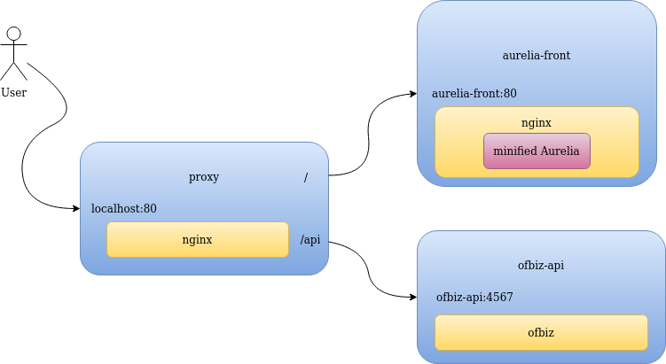

# `Ofbiz-UI`

_Currently deployed to: [35.228.129.189](http://35.228.129.189)_

## Install dependencies
_(Only needed for developing / running in dev mode)_

```bash
npm install -g aurelia-cli
npm install
```

## Run dev app
_Allows hot reload_
```bash
# --< In backend repo >--

# Start ofbiz locally
./gradlew [cleanAll loadAll] ofbiz
# Or with newer version of back
./deploy.sh


# --< In frontend repo (here) >--

# Start aurelia app
au run

# Start proxy
# Use --build to recreate containers
docker-compose -f docker-compose-dev.yml up [--build]
```

## Run fully in docker
_Only exposes port 80 to public, uses nginx to serve front  
_Don't use this for now_
```bash
# --< In backend repo >--

# Start ofbiz in docker  
./deploy-dev.sh

# --< In frontend repo (here) >--

# Start proxy and front
# Use --build to recreate containers
docker-compose up [--build]
```

**If something is broken with proxy/docker...**
- Make sore you have correct ports opened if running on windows _(especially using docker-toolbox)_
- On unix files created in docker need sudo rights to be removed so that might be a problem if backend doesn't build
- You can contact Tavo Annus (kilpkonn)

## Running fully in docker architecture/diagram



[Dynamic Menu Guide](docs/dynamic-menu.md)
